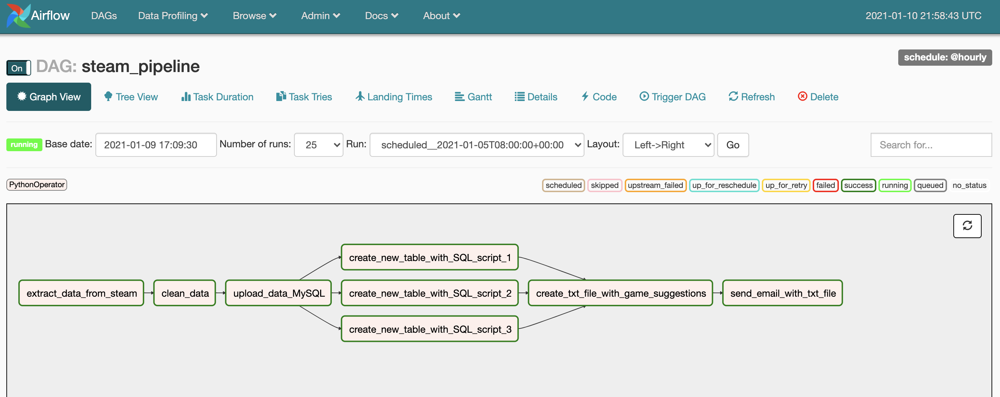

# Steam Data Pipeline

## About: ##
I always wanted to automate my daily routine of checking Steam.com and searching for daily discounts and deals on PC games. 
Through the implementation of a data pipeline I was able to create a way to automate the reading of all the games on Steam's
website and further sort games that I personally would potentially enjoy (e.g., games that are "free to play" that also have 
"overwhelmingly positive" reviews). Once a list of games that I wol enjoy is generated, an automated email is sent to me every
morning containing new suggestions based on my search criteria.

## Project Description: ##
This project utilizes various technologies like Apache Airflow, DAGs, Jupyter Notebook, Pandas, MySQL and AWS S3 to build
an end to end data pipeline for extracting data using Web Scraping and then processing the data in the pipeline by using
Jupyter Notebook and Pandas. The final output is uploaded on an AWS S3 bucket. The pipeline is scheduled to run on a daily basis.

## Use Case: ##
I wanted to automate the process of looking at Steam's website for daily discounts on PC games. This
data pipeline will extract the data through web scraping off Steam's website, clean the data, and then
send me an email with a list of discounted games that meet my predefined specifications (e.g. send me all
"free to play" games) using MySQL scripts.

## How it Works: ##
The top 50 games from Steam's wesbite are webscraped and put into a csv file showing their: Title, Release Date, Review Score, Original Price, Percent Discount and Discounted price. Data cleaning is done using Pandas to ensure there are no missing values and to ensure uniform formatting. The csv file is put into a pandas dataframe and uploaded onto MySQL for storage and further querying. A MySQL query is executed to create a new table from the original csv table, that contains games that meet my personal specifications (e.g., games that are free and games that are reviewed as "Overwhelmingly Positive" and are $15 or less). The new table is converted into a txt file and through Python's smtplib module, the txt file is emailed to my personal email every morning.

## Technologies Used: ## 
  * Python 
  * Pandas
  *	Jupyter Notebook
  *	Apache Airflow
  *	DAGs
  *	MySQL
  *	AWS S3

## Implications: ##
This data pipeline could be used by anyone interested in automating the routine of checking Steam.com for PC games that
they themselves are interested in for example a Star Wars fan might only have the pipeline find games with "Star Wars" in 
their title. Further implementation of this data pipeline could be applied to different websites to find certain items that are
of interest.
